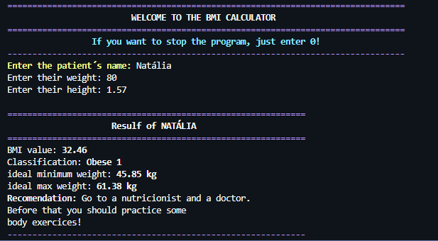
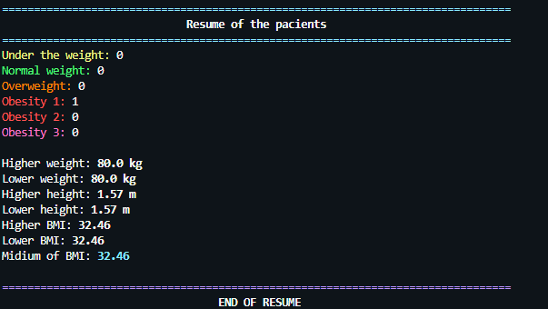

# 🍕 BMI_Calculator 🍩
> This project was made initially to study and improve my logical and technical skills using Python and good programming practices, as well as to practice English for technology.

---


---

## 📜 Table of Contents

1. [About](#About)  
2. [Features](#Features)  
3. [Screenshoots](#Screenshots)  
4. [Tech Stack](#TechStack)  
5. [Prerequisites](#Prerequisites)  
6. [Installation](#Installation)  
7. [Usage](#Usage)  
8. [Roadmap](#Roadmap)  
9. [Author](#Author)  

---

## 📌 About

> Command-line application to calculate BMI for multiple patients and produce consolidated reports, designed as a study project to demonstrate Python best practices.

---

## 💻 Features

- BMI calculation for multiple patients
- Classification by range (underweight, normal, overweight, obese 1-3)
- End-of-run summary with statistics (max, min, average)

| Feature | Status | Notes |
|---|---:|---|
| BMI calculation | ✅ | Supports multiple patients |
| Final Report | ❌ | Export to .txt planned |
| Input Validation | ✅ | In progress |

---

## 📸 Screenshots




---

## 🛠️ Tech Stack

| Layer | Technology / Library |
|---|---|
| Language | Python 3.12+ |


---


## ⚙️ Prerequisites

- Python 3.12+  


---


## 🔨 Installation

```bash
git clone <REPO_URL>
cd <project-folder>
python -m venv .venv
source .venv/bin/activate   # macOS / Linux
.venv\Scripts\activate    # Windows
pip install -r requirements.txt
```


---

## 🖥️ Usage

```bash
python BMI_calculator.py
```


---


## 🛤️ Roadmap

| Version | Goal |
|---|---|
| v0.1 | MVP: Calculation and basic report |
| v0.2 | Export to CSV / TXT |
| v1.0 | Web Interface (Streamlit) |


---

## 😎 Author

**Natália Kiefer** — [GitHub](https://github.com/nkf-kiefer)

---
